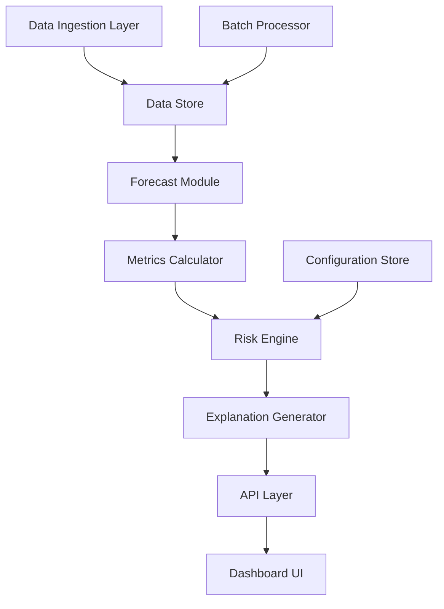
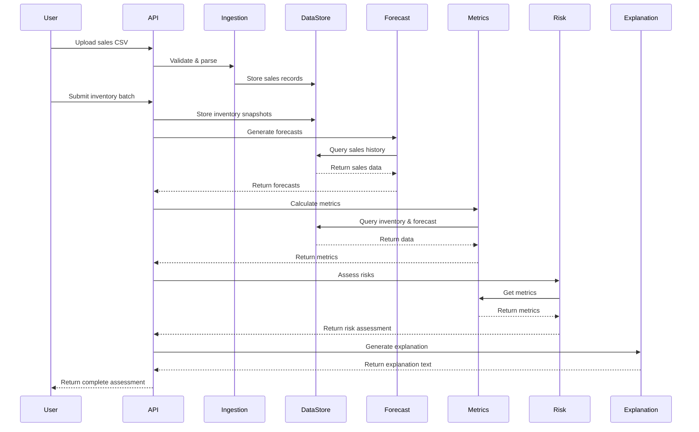

# Design Document: Explainable Inventory Risk Intelligence System

## Overview

The Explainable Inventory Risk Intelligence System is a decision-support tool that analyzes retail sales data to identify inventory risks and provide clear, actionable explanations. The system architecture follows a modular design with clear separation between data ingestion, forecasting, risk analysis, and presentation layers.

The core design philosophy emphasizes:
- **Explainability**: Every risk assessment includes human-readable explanations
- **Transparency**: All metrics and calculations are interpretable by business users
- **Simplicity**: Uses baseline forecasting methods that are easy to understand and validate
- **Modularity**: Components can be tested, extended, and replaced independently

The system processes historical sales data through a pipeline: ingestion → forecasting → metrics calculation → risk detection → explanation generation → visualization. Each stage produces interpretable outputs that can be validated by business users.

## Architecture

### System Components



### Component Responsibilities

**Data Ingestion Layer**
- Validates CSV file format and required columns
- Parses sales data (product_id, date, quantity_sold)
- Handles error cases (missing columns, invalid formats)
- Stores validated data in the data store

**Data Store**
- Persists historical sales data
- Stores current inventory levels
- Maintains risk assessment history
- Provides query interface for time-series data

**Forecast Module**
- Generates 7-day demand forecasts using moving average or exponential smoothing
- Calculates forecast confidence based on data availability
- Detects demand trends (increasing, stable, decreasing)
- Handles edge cases (insufficient history, high variance)

**Metrics Calculator**
- Computes Days of Cover: current_inventory / avg_daily_forecasted_demand
- Computes Sell-Through Rate: units_sold / units_available over 30-day period
- Identifies demand patterns and velocity
- Normalizes metrics for consistent interpretation

**Risk Engine**
- Evaluates Stockout Risk: Days_of_Cover < 5 AND demand stable/increasing
- Evaluates Dead Inventory Risk: Days_of_Cover > 30 AND Sell_Through_Rate < 20%
- Assigns severity levels (high, medium, low) based on metric thresholds
- Applies configurable threshold parameters

**Explanation Generator**
- Produces plain English explanations for detected risks
- Includes specific metric values that triggered the risk
- Suggests recommended actions (reorder, reduce orders, promote, investigate)
- Maintains consistent explanation templates

**API Layer**
- Exposes REST endpoints for data submission and risk retrieval
- Handles authentication via API keys
- Returns JSON responses with metrics and explanations
- Provides error handling with standard HTTP status codes

**Dashboard UI**
- Displays product list with risk flags and color coding
- Shows metrics (Days of Cover, Sell-Through Rate, demand trend)
- Renders risk explanations and recommended actions
- Provides historical sales trend charts
- Supports sorting, filtering, and product selection

**Batch Processor**
- Processes uploaded files with multiple products
- Matches products with historical data
- Generates risk assessments for all products
- Returns structured results (JSON/CSV)

**Configuration Store**
- Maintains risk detection thresholds
- Stores system parameters (forecast window, metric periods)
- Allows runtime threshold updates

## Components and Interfaces

### Data Models

**SalesRecord**
```
{
  product_id: string
  date: date (YYYY-MM-DD)
  quantity_sold: number (non-negative integer)
  timestamp: datetime (when record was created)
}
```

**InventorySnapshot**
```
{
  product_id: string
  current_inventory: number (non-negative integer)
  snapshot_date: date
  last_updated: datetime
}
```

**DemandForecast**
```
{
  product_id: string
  forecast_date: date
  forecasted_daily_demand: number (non-negative float)
  confidence_level: enum (high, medium, low)
  method_used: string (e.g., "7-day moving average")
  trend: enum (increasing, stable, decreasing)
}
```

**InventoryMetrics**
```
{
  product_id: string
  days_of_cover: number (float, can be null if no forecast)
  sell_through_rate: number (percentage, 0-100)
  demand_velocity: number (units per day)
  trend: enum (increasing, stable, decreasing)
  calculation_date: date
}
```

**RiskAssessment**
```
{
  product_id: string
  risk_type: enum (stockout, dead_inventory, none)
  severity: enum (high, medium, low, none)
  risk_score: number (0-100)
  explanation: string (human-readable)
  recommended_action: string
  metrics: InventoryMetrics
  forecast: DemandForecast
  assessment_date: datetime
}
```

**RiskConfiguration**
```
{
  stockout_days_threshold: number (default: 5)
  dead_inventory_days_threshold: number (default: 30)
  sell_through_rate_threshold: number (default: 20)
  forecast_window_days: number (default: 7)
  sell_through_period_days: number (default: 30)
}
```

### Interface Specifications

**DataIngestionService**
```
interface DataIngestionService {
  validateFile(file: File) -> ValidationResult
  parseSalesData(file: File) -> List<SalesRecord>
  storeSalesData(records: List<SalesRecord>) -> StorageResult
}

ValidationResult {
  is_valid: boolean
  errors: List<string>
  warnings: List<string>
  row_count: number
}
```

**ForecastService**
```
interface ForecastService {
  generateForecast(product_id: string, history_days: number) -> DemandForecast
  detectTrend(sales_history: List<SalesRecord>) -> TrendEnum
  calculateConfidence(sales_history: List<SalesRecord>) -> ConfidenceEnum
}
```

**MetricsService**
```
interface MetricsService {
  calculateDaysOfCover(inventory: number, forecast: DemandForecast) -> number
  calculateSellThroughRate(product_id: string, period_days: number) -> number
  calculateDemandVelocity(sales_history: List<SalesRecord>) -> number
  computeMetrics(product_id: string, inventory: number) -> InventoryMetrics
}
```

**RiskService**
```
interface RiskService {
  assessRisk(product_id: string, metrics: InventoryMetrics, config: RiskConfiguration) -> RiskAssessment
  detectStockoutRisk(metrics: InventoryMetrics, config: RiskConfiguration) -> RiskLevel
  detectDeadInventoryRisk(metrics: InventoryMetrics, config: RiskConfiguration) -> RiskLevel
  calculateSeverity(metrics: InventoryMetrics, risk_type: RiskTypeEnum) -> SeverityEnum
}
```

**ExplanationService**
```
interface ExplanationService {
  generateExplanation(risk: RiskAssessment) -> string
  formatStockoutExplanation(metrics: InventoryMetrics, forecast: DemandForecast) -> string
  formatDeadInventoryExplanation(metrics: InventoryMetrics) -> string
  suggestAction(risk: RiskAssessment) -> string
}
```

**API Endpoints**
```
POST /api/sales/upload
  Request: multipart/form-data with CSV file
  Response: { success: boolean, products_processed: number, date_range: string }

POST /api/inventory/batch
  Request: { products: [{ product_id: string, current_inventory: number }] }
  Response: { assessments: List<RiskAssessment> }

GET /api/risk/product/:product_id
  Response: RiskAssessment

GET /api/risk/all?filter=stockout|dead_inventory|all&severity=high|medium|low
  Response: { assessments: List<RiskAssessment>, total_count: number }

GET /api/metrics/product/:product_id
  Response: InventoryMetrics

GET /api/forecast/product/:product_id
  Response: DemandForecast

PUT /api/config/thresholds
  Request: RiskConfiguration
  Response: { success: boolean, updated_config: RiskConfiguration }
```

## Data Models

### Core Entities

**Product**
- Represents a distinct retail item
- Identified by unique product_id
- Associated with sales history and current inventory
- May have metadata (name, category, supplier) for display purposes

**Sales History**
- Time-series of daily sales records per product
- Minimum 7 days recommended for reliable forecasting
- Stored as individual records for flexibility
- Indexed by product_id and date for efficient queries

**Inventory State**
- Current on-hand quantity for each product
- Updated via batch uploads or API calls
- Snapshot timestamp for tracking staleness
- Used in conjunction with forecast for risk calculation

**Risk State**
- Current risk assessment for each product
- Includes risk type, severity, and explanation
- Timestamped for historical tracking
- Cached to avoid redundant calculations

### Data Flow



### Data Validation Rules

**Sales Data Validation**
- product_id: non-empty string, max 100 characters
- date: valid date in YYYY-MM-DD format, not in future
- quantity_sold: non-negative integer
- No duplicate records for same product_id and date

**Inventory Data Validation**
- product_id: must match existing product in sales history
- current_inventory: non-negative integer
- snapshot_date: valid date, typically current date

**Forecast Validation**
- forecasted_daily_demand: non-negative float
- confidence_level: must be high, medium, or low
- trend: must be increasing, stable, or decreasing

**Metrics Validation**
- days_of_cover: non-negative float or null (if no forecast available)
- sell_through_rate: 0-100 percentage
- demand_velocity: non-negative float

**Risk Configuration Validation**
- stockout_days_threshold: positive number, typically 3-10
- dead_inventory_days_threshold: positive number, typically 20-60
- stockout_days_threshold < dead_inventory_days_threshold (logical consistency)
- sell_through_rate_threshold: 0-100 percentage


## Correctness Properties

*A property is a characteristic or behavior that should hold true across all valid executions of a system—essentially, a formal statement about what the system should do. Properties serve as the bridge between human-readable specifications and machine-verifiable correctness guarantees.*

### Data Ingestion Properties

**Property 1: CSV validation correctness**
*For any* CSV file, the validation should accept files with all required columns (product_id, date, quantity_sold) and reject files missing any required column
**Validates: Requirements 1.1, 1.3**

**Property 2: Sales data parsing round-trip**
*For any* valid sales record, parsing and storing then retrieving should produce an equivalent record with the same product_id, date, and quantity_sold
**Validates: Requirements 1.2**

**Property 3: Ingestion confirmation accuracy**
*For any* batch of sales data successfully ingested, the confirmation message should report the exact number of unique products and the correct date range (min to max date) present in the data
**Validates: Requirements 1.4**

**Property 4: Date format validation**
*For any* date string, the system should accept only dates in YYYY-MM-DD format and reject all other formats
**Validates: Requirements 1.5**

### Forecasting Properties

**Property 5: Forecast generation completeness**
*For any* product with at least one day of sales history, the Forecast_Module should generate a 7-day demand forecast with a non-negative forecasted_daily_demand value
**Validates: Requirements 2.1**

**Property 6: Forecast output format**
*For any* generated forecast, the forecasted_daily_demand should be expressed as a daily average quantity (non-negative float)
**Validates: Requirements 2.4**

**Property 7: Variance detection**
*For any* sales history with high variance (coefficient of variation > 0.5), the forecast should flag confidence_level as "low"
**Validates: Requirements 2.5**

### Metrics Calculation Properties

**Property 8: Days of Cover calculation**
*For any* product with current_inventory > 0 and forecasted_daily_demand > 0, Days_of_Cover should equal current_inventory / forecasted_daily_demand
**Validates: Requirements 3.1, 3.3**

**Property 9: Sell-Through Rate calculation**
*For any* product with sales history over a 30-day period, Sell_Through_Rate should equal (units_sold / units_available) * 100, bounded between 0 and 100
**Validates: Requirements 3.2**

**Property 10: Trend classification**
*For any* sales history, the detected trend should be "increasing" if recent sales > earlier sales, "decreasing" if recent sales < earlier sales, and "stable" if the difference is within 10%
**Validates: Requirements 3.4**

**Property 11: Metric unit formatting**
*For any* calculated metrics, Days_of_Cover should be in days (float), Sell_Through_Rate should be a percentage (0-100), and trend should be a label (increasing/stable/decreasing)
**Validates: Requirements 3.5**

### Risk Detection Properties

**Property 12: Stockout risk detection**
*For any* product where Days_of_Cover < 5 AND trend is "stable" or "increasing", the Risk_Engine should flag risk_type as "stockout"
**Validates: Requirements 4.1**

**Property 13: Stockout severity calculation**
*For any* product flagged with Stockout_Risk, the severity should be "high" when Days_of_Cover < 2, "medium" when Days_of_Cover < 4, and "low" when Days_of_Cover < 5, based on Days_of_Cover and demand trend strength
**Validates: Requirements 4.2, 4.3**

**Property 14: Product prioritization by risk**
*For any* set of products with stockout risks, products should be ordered by priority where lower Days_of_Cover and higher demand_velocity result in higher priority
**Validates: Requirements 4.5**

**Property 15: Dead inventory risk detection**
*For any* product where Days_of_Cover > 30 AND Sell_Through_Rate < 20%, the Risk_Engine should flag risk_type as "dead_inventory"
**Validates: Requirements 5.1**

**Property 16: Dead inventory severity calculation**
*For any* product flagged with Dead_Inventory_Risk, the severity should be calculated based on Days_of_Cover (higher = more severe) and Sell_Through_Rate (lower = more severe), with "high" when Days_of_Cover > 60 OR Sell_Through_Rate < 10%
**Validates: Requirements 5.2, 5.3**

**Property 17: Dead inventory severity adjustment for declining demand**
*For any* product with Dead_Inventory_Risk and trend "decreasing", the severity should be at least one level higher than it would be with "stable" trend
**Validates: Requirements 5.4**

**Property 18: Stockout exclusion from dead inventory**
*For any* product that had a stockout (inventory = 0) within the last 30 days, it should not be flagged with Dead_Inventory_Risk regardless of current Days_of_Cover or Sell_Through_Rate
**Validates: Requirements 5.5**

### Explanation Generation Properties

**Property 19: Explanation completeness and consistency**
*For any* detected risk (stockout or dead_inventory), the system should generate a Risk_Explanation that is non-empty, in plain English, and follows a consistent format structure
**Validates: Requirements 6.1, 6.6**

**Property 20: Explanation metric inclusion**
*For any* Risk_Explanation, the text should contain the specific metric values that triggered the risk, including Days_of_Cover value and either demand trend (for stockout) or Sell_Through_Rate (for dead inventory)
**Validates: Requirements 6.2**

**Property 21: Stockout explanation content**
*For any* Stockout_Risk explanation, the text should include current_inventory value, forecasted_daily_demand value, and days_until_stockout (Days_of_Cover)
**Validates: Requirements 6.3**

**Property 22: Dead inventory explanation content**
*For any* Dead_Inventory_Risk explanation, the text should include current_inventory value, Sell_Through_Rate value, and excess Days_of_Cover value
**Validates: Requirements 6.4**

**Property 23: Action recommendation presence**
*For any* Risk_Explanation, the text should include a recommended_action that is one of: "reorder", "reduce orders", "promote product", or "investigate"
**Validates: Requirements 6.5**

### Dashboard Properties

**Property 24: Dashboard color coding**
*For any* product displayed on the dashboard, the color code should be "red" for severity "high", "yellow" for severity "medium", and "green" for severity "low" or "none"
**Validates: Requirements 7.2**

**Property 25: Product display completeness**
*For any* product displayed on the dashboard, the display data should include Days_of_Cover, Sell_Through_Rate, demand trend, and Risk_Explanation (if risk is flagged)
**Validates: Requirements 7.3, 7.4**

**Property 26: Product selection chart data**
*For any* product selected on the dashboard, the system should return historical sales data suitable for rendering a trend chart (list of date-quantity pairs)
**Validates: Requirements 7.5**

**Property 27: Dashboard filtering correctness**
*For any* filter applied (risk_type or severity), the returned product list should contain only products matching the filter criteria
**Validates: Requirements 7.6**

### Batch Processing Properties

**Property 28: Batch processing completeness**
*For any* batch file with N products, the system should process all N products, match them with historical sales data where available, and generate risk assessments for all products with sufficient data
**Validates: Requirements 8.1, 8.2, 8.3**

**Property 29: Batch output format**
*For any* batch processing result, the output should be valid JSON or CSV containing all required fields: product_id, risk_type, severity, Days_of_Cover, Sell_Through_Rate, and Risk_Explanation
**Validates: Requirements 8.4**

**Property 30: Insufficient data handling**
*For any* product in a batch that has no historical sales data, the system should flag it with status "insufficient data" and skip risk assessment (no risk_type assigned)
**Validates: Requirements 8.5**

### API Properties

**Property 31: API authentication enforcement**
*For any* API request without a valid API key, the system should return HTTP 401 Unauthorized and reject the request
**Validates: Requirements 10.2**

**Property 32: API response format**
*For any* successful API request for risk assessment, the response should be valid JSON containing all required fields: product_id, risk_type, severity, metrics (Days_of_Cover, Sell_Through_Rate), forecast, and explanation
**Validates: Requirements 10.3**

**Property 33: API error status codes**
*For any* API error condition, the system should return appropriate HTTP status codes: 400 for bad requests, 401 for authentication failures, 404 for not found, 500 for server errors
**Validates: Requirements 10.4**

### Historical Tracking Properties

**Property 34: Risk snapshot persistence**
*For any* generated risk assessment, the system should store a snapshot with timestamp, and retrieving it should return the same risk_type, severity, and metrics
**Validates: Requirements 11.1**

**Property 35: Historical data retrieval**
*For any* product with historical risk assessments, querying historical data should return a time-series of risk scores and explanations ordered by timestamp
**Validates: Requirements 11.3**

**Property 36: Risk comparison accuracy**
*For any* product with multiple risk assessments, comparing current state with a previous assessment should correctly identify changes in risk_type, severity, and key metrics
**Validates: Requirements 11.4**

**Property 37: Risk lifecycle tracking**
*For any* risk that appears and then disappears, the system should record the first_detected timestamp when risk_type changes from "none" to a risk, and resolved timestamp when it changes back to "none"
**Validates: Requirements 11.5**

### Configuration Properties

**Property 38: Threshold configuration effect**
*For any* change to risk thresholds (stockout_days_threshold, dead_inventory_days_threshold, or sell_through_rate_threshold), re-evaluating a product should use the new thresholds and may produce different risk flags
**Validates: Requirements 12.1, 12.2, 12.3, 12.4**

**Property 39: Threshold validation**
*For any* threshold configuration, the system should reject configurations where stockout_days_threshold >= dead_inventory_days_threshold, as this violates logical consistency
**Validates: Requirements 12.5**

## Error Handling

### Error Categories

**Data Validation Errors**
- Invalid CSV format: Missing required columns, incorrect data types
- Invalid date formats: Dates not in YYYY-MM-DD format, future dates
- Invalid quantities: Negative values, non-numeric values
- Duplicate records: Same product_id and date combination

**Data Availability Errors**
- Insufficient sales history: Product has no historical data
- Missing inventory data: Product has sales history but no current inventory snapshot
- Missing forecast: Forecast generation failed due to data issues

**Calculation Errors**
- Division by zero: Forecasted demand is zero when calculating Days_of_Cover
- Invalid metric ranges: Calculated values outside expected bounds
- Trend detection failure: Insufficient data points for trend analysis

**API Errors**
- Authentication failure: Invalid or missing API key
- Malformed requests: Invalid JSON, missing required fields
- Resource not found: Product_id does not exist
- Rate limiting: Too many requests in time window

**System Errors**
- Database connection failures
- File system errors during CSV processing
- Timeout errors for long-running calculations

### Error Handling Strategies

**Graceful Degradation**
- When forecast cannot be generated, set Days_of_Cover to null and skip risk assessment
- When trend detection fails, default to "stable" trend
- When confidence cannot be calculated, default to "low" confidence

**Clear Error Messages**
- All errors include descriptive messages explaining what went wrong
- Validation errors specify which field failed and why
- API errors include error codes and suggested remediation

**Error Logging**
- All errors logged with timestamp, context, and stack trace
- Critical errors trigger alerts for system administrators
- Error patterns tracked for system health monitoring

**Fallback Behaviors**
- If exponential smoothing fails, fall back to simple moving average
- If 7-day history unavailable, use available days with confidence flag
- If batch processing partially fails, return results for successful products with error list

**User-Facing Error Responses**
```
{
  "success": false,
  "error": {
    "code": "INVALID_CSV_FORMAT",
    "message": "Missing required column: quantity_sold",
    "details": {
      "found_columns": ["product_id", "date"],
      "required_columns": ["product_id", "date", "quantity_sold"]
    }
  }
}
```

## Testing Strategy

**Note:** The testing strategy described below represents the intended quality assurance approach for a full implementation. For the hackathon MVP, the focus is on validating core risk detection logic, explainability, and end-to-end flow using representative test cases and limited automated tests.

### Dual Testing Approach

The system employs both unit testing and property-based testing to ensure comprehensive coverage:

**Unit Tests** focus on:
- Specific examples that demonstrate correct behavior
- Edge cases (zero inventory, single-day history, extreme values)
- Error conditions (invalid inputs, missing data, calculation errors)
- Integration points between components
- Specific business scenarios (e.g., product with recent stockout)

**Property-Based Tests** focus on:
- Universal properties that hold for all valid inputs
- Comprehensive input coverage through randomization
- Invariants that must be maintained (e.g., Days_of_Cover calculation formula)
- Round-trip properties (e.g., data ingestion and retrieval)
- Metamorphic properties (e.g., threshold changes affect risk detection)

Together, unit tests catch concrete bugs in specific scenarios, while property tests verify general correctness across the input space.

### Property-Based Testing Configuration

**Testing Library**: We will use **fast-check** for JavaScript/TypeScript (for the Express.js API and React frontend) and **Hypothesis** for Python (for the data pipeline and forecasting scripts).

**Test Configuration**:
- Each property test runs a minimum of **100 iterations** to ensure comprehensive coverage
- Each test is tagged with a comment referencing its design document property
- Tag format: `// Feature: inventory-risk-intelligence, Property N: [property description]`

**Example Property Test Structure** (TypeScript with fast-check):
```typescript
// Feature: inventory-risk-intelligence, Property 8: Days of Cover calculation
test('Days of Cover equals inventory divided by forecasted demand', () => {
  fc.assert(
    fc.property(
      fc.integer({ min: 1, max: 10000 }), // current_inventory
      fc.float({ min: 0.1, max: 100 }), // forecasted_daily_demand
      (inventory, demand) => {
        const daysOfCover = calculateDaysOfCover(inventory, demand);
        const expected = inventory / demand;
        expect(daysOfCover).toBeCloseTo(expected, 2);
      }
    ),
    { numRuns: 100 }
  );
});
```

**Example Property Test Structure** (Python with Hypothesis):
```python
# Feature: inventory-risk-intelligence, Property 12: Stockout risk detection
@given(
    days_of_cover=st.floats(min_value=0, max_value=4.99),
    trend=st.sampled_from(['stable', 'increasing'])
)
@settings(max_examples=100)
def test_stockout_risk_detection(days_of_cover, trend):
    metrics = InventoryMetrics(
        days_of_cover=days_of_cover,
        trend=trend
    )
    risk = assess_risk(metrics, default_config)
    assert risk.risk_type == 'stockout'
```

### Test Coverage Requirements

**Component-Level Testing**:
- Data Ingestion: CSV validation, parsing, error handling
- Forecast Module: Forecast generation, trend detection, confidence calculation
- Metrics Calculator: Days_of_Cover, Sell_Through_Rate, demand velocity
- Risk Engine: Stockout detection, dead inventory detection, severity calculation
- Explanation Generator: Template rendering, metric inclusion, action suggestions
- API Layer: Endpoint responses, authentication, error handling

**Integration Testing**:
- End-to-end flow: CSV upload → forecast → metrics → risk → explanation
- Batch processing: Multiple products processed correctly
- Configuration changes: Threshold updates trigger re-evaluation
- Historical tracking: Risk snapshots stored and retrieved correctly

**Property Test Coverage**:
- Each of the 39 correctness properties has a corresponding property-based test
- Properties are tested in isolation where possible
- Complex properties may require test fixtures or helper functions

**Edge Case Coverage** (via unit tests):
- Zero inventory with positive demand (critical stockout)
- Products with < 7 days history (limited confidence)
- Products with recent stockouts (excluded from dead inventory)
- Empty CSV files, single-row files
- Extreme values (very high inventory, very low demand)
- Boundary conditions (Days_of_Cover exactly at thresholds)

### Test Data Generation

**Property Test Generators**:
- Product IDs: Random alphanumeric strings (5-20 characters)
- Dates: Random dates within last 365 days
- Quantities: Random integers (0-1000) with occasional zeros
- Inventory levels: Random integers (0-10000)
- Demand forecasts: Random floats (0.1-100)
- Trends: Random selection from [increasing, stable, decreasing]
- Sell-Through Rates: Random floats (0-100)

**Edge Case Generators**:
- Zero inventory scenarios
- Single-day history scenarios
- High variance sales patterns
- Products with recent stockouts
- Extreme Days_of_Cover values (< 1 day, > 100 days)

**Realistic Test Scenarios**:
- Seasonal products (high variance)
- Steady sellers (low variance, stable trend)
- Declining products (decreasing trend)
- Fast movers (high demand velocity)
- Slow movers (low Sell_Through_Rate)

### Continuous Testing

**Test Execution**:
- All tests run on every commit (CI/CD pipeline)
- Property tests run with 100 iterations in CI, 1000 iterations nightly
- Integration tests run after unit and property tests pass
- Performance benchmarks run weekly

**Test Maintenance**:
- Property tests updated when requirements change
- New properties added for new features
- Failing property tests investigated immediately (may indicate bugs or invalid assumptions)
- Test coverage monitored (target: >90% line coverage, 100% property coverage)
